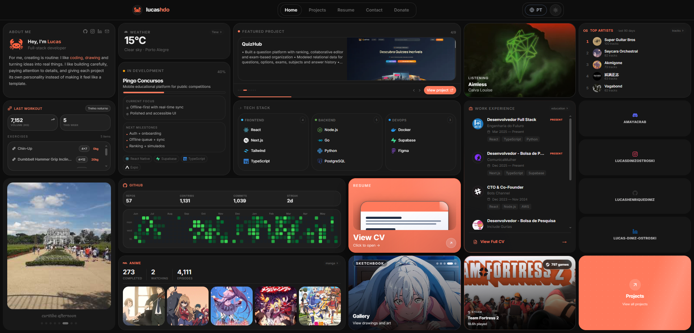

# Bento Portfolio

A modular **Bento-style personal portfolio** built as a monorepo with a React/Vite frontend and Cloudflare Pages Functions for secure API integrations.

🔗 **Live:** [lucashdo.com](https://lucashdo.com)

> **Related:** [Lucas UI Vault](https://ui.lucashdo.com/) — a React component library with live previews and code snippets ([repo](https://github.com/LucasHenriqueDiniz/lucas-ui-database)).
>
> **Previous version:** [old-lucas-portfolio](https://github.com/LucasHenriqueDiniz/old-lucas-portfolio).

## Showcase

[](https://lucashdo.com)

The interface highlights real-world data (GitHub activity, music, games, anime, workouts, weather, and professional experience) inside responsive cards with smooth motion and clean typography.

## Project Description

This project is designed to present a complete developer profile in a single interactive page:

- **Who I am**: intro, bio, and social links.
- **What I build**: featured projects and technical stack.
- **What I do**: professional timeline and resume access.
- **What I track**: integrations with external platforms and personal metrics.

The architecture keeps secrets on the backend via Cloudflare Functions, while the frontend focuses on performance, UI consistency, and accessibility.

## Tech Stack

- **Monorepo / Workspace:** pnpm workspaces
- **Frontend:** React 19, Vite 7, Tailwind CSS 4, Wouter, TanStack Query, Framer Motion, Radix UI
- **Backend:** Cloudflare Pages Functions
- **Language:** TypeScript
- **Deploy:** Cloudflare Pages

## Getting Started

### Prerequisites

- Node.js 18+
- pnpm

### Install

```bash
pnpm install
```

### Environment variables

```bash
cp .env.example .env
```

Then fill your `.env` with your own credentials.

## Development

```bash
pnpm dev
```

Useful alternatives:

```bash
pnpm dev:portfolio
pnpm dev:api
pnpm typecheck
pnpm build
```

## Public API

The Cloudflare Pages Function at `artifacts/portfolio/functions/api/[[path]].ts` exposes a handful of read-only, unauthenticated `GET` endpoints that back the portfolio's widgets. They are documented here for discoverability (see `/.well-known/api-catalog`):

| Endpoint | Description |
| --- | --- |
| `/api/portfolio/now-playing` | Currently playing track (Last.fm) |
| `/api/portfolio/top-artists` | Top artists, 3-month window (Last.fm) |
| `/api/portfolio/top-tracks` | Top tracks, 3-month window (Last.fm) |
| `/api/portfolio/steam` | Steam profile and recently played games |
| `/api/portfolio/workout` | Most recent workout and weekly stats (Lyfta) |
| `/api/portfolio/stats` | GitHub contribution and language stats |
| `/api/portfolio/mal` | MyAnimeList stats and favorites |

All responses are JSON, cached at the edge (KV + Cache API), and intended for this portfolio's own UI — there is no SLA or versioning guarantee for third-party consumption.

## Project Structure

```bash
artifacts/
  portfolio/      # React + Vite app (frontend + Cloudflare functions)
```

## License

This project is licensed under the MIT License — see the [LICENSE](./LICENSE) file for details.