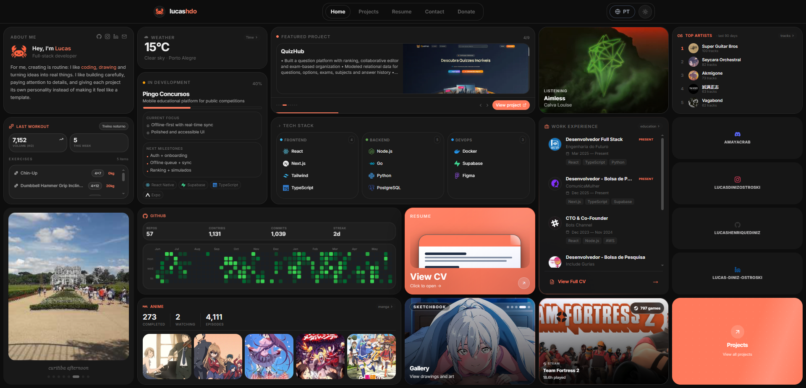

# Bento Portfolio

My personal portfolio, Bento-style: a grid of cards showing experience, projects, skills, social links, and live integrations (GitHub, Last.fm, Steam, MyAnimeList, weather, etc). React + Vite + TypeScript on the frontend, Cloudflare Pages Functions as the backend proxying external APIs — credentials never reach the client.

> Previous version: [old-lucas-portfolio](https://github.com/LucasHenriqueDiniz/old-lucas-portfolio)

## Preview



## Stack

React 19 · Vite 7 · TypeScript · Tailwind CSS 4 · TanStack Query · i18next · Cloudflare Pages Functions

## Structure

```txt
artifacts/portfolio/
  functions/   # API (Cloudflare Pages Functions)
  src/         # React app
  public/      # Static assets
```

## License

MIT
